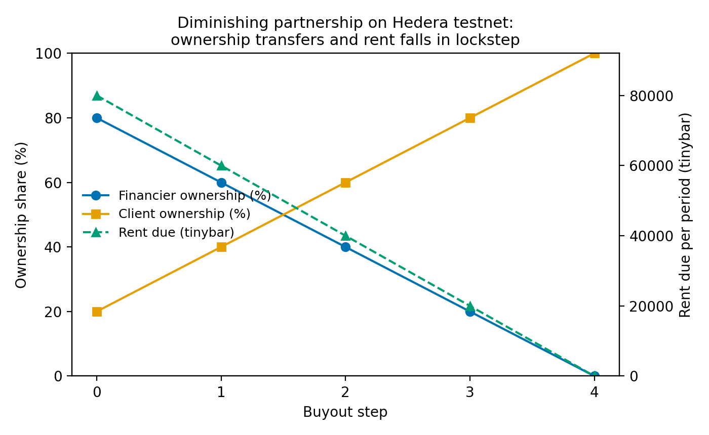
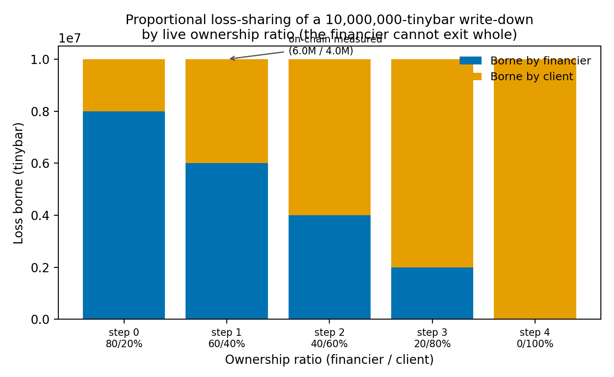

# Compliance by Construction: Enforcing the Contractual Conditions of a Shari'ah-Compliant Diminishing Partnership on a Public Ledger

> Consolidated manuscript (v3): adds tokenized ownership (HTS), HTS-native atomic buyout, and khiyar/iqalah rescission. The artifact now custodies capital and settles on dissolution
> (MusharakahMutanaqisahV2). Academic and standards citations are verified; Qur'anic and
> hadith references are cited by surah:ayah / collection and marked `[scholar-verify]` —
> exact hadith numbering and every point of *fiqh* ruling must be confirmed by a qualified
> scholar. **No fatwa is claimed; this paper makes an engineering, not a juristic, claim.**

## Abstract

Contemporary Islamic finance is recurrently criticised for *form over substance*: an
instrument is certified Shari'ah-compliant once, by a board, after which no party can
continuously verify that its economic substance still matches its certified form. We
propose **compliance by construction** — encoding the contractual conditions that
distinguish a genuine Shari'ah-compliant instrument from disguised debt as invariants a
smart contract enforces at execution time, so a violating transaction simply does not
execute. We demonstrate the principle on *Musharakah Mutanaqisah* (diminishing
partnership), implemented as a capital-custodying smart contract on Hedera. The contract
escrows both partners' capital, charges rent only on the financier's living share, prices
buyouts from an independent valuation oracle, and on dissolution pays each partner its
share of the asset's *current* value — so a loss provably reduces the financier's
recoverable capital by transfer, not by assertion. We evaluate the artifact with a unit
test suite (10/10 passing), an adversarial three-account lifecycle on the Hedera testnet,
a static-analysis pass (0 errors), and per-operation cost measurement. On-chain, after a
10% asset write-down the financier recovered 72,000,000 of the 80,000,000 tinybar it had
funded — bearing its proportional loss as enforced by the protocol — while role-violating
transactions reverted. We argue the deeper contribution is a reframing: the Shari'ah board
moves from *certifier of an instrument* to *auditor of a protocol*. We are explicit about
the boundary: binding real-world facts still enter through a trusted valuer, on-chain
ownership lacks legal title, and reconciling enforced finality with the *fiqh* options of
*khiyar* and *iqalah* remains open. In an extended artifact family we further represent ownership as a real Hedera Token Service token whose units move atomically with payment, and we encode the *fiqh* rescission rights (*khiyar al-shart* and *iqalah*) the sentence above notes as open — leaving their juristic adequacy to qualified scholars.

**Keywords:** Islamic finance; *Musharakah Mutanaqisah*; smart contracts; design science;
Shari'ah governance; blockchain; risk-sharing.

## 1. Introduction

For half a century, Islamic finance has lived with a quiet contradiction. Its normative
ideal is participation — the sharing of profit and loss, the binding of finance to the
real economy, the refusal of a guaranteed return on money lent (Qur'an, al-Baqarah 2:275
`[scholar-verify]`). Its dominant practice, however, leans on debt-like instruments —
*murabaha*, and especially organized *tawarruq* — whose economic substance reproduces the
interest-bearing loan they were meant to replace. The critique is neither marginal nor
new: the OIC International Islamic Fiqh Academy declared organized *tawarruq* impermissible
(Resolution 179 (19/5), 19th session, Sharjah, April 2009), and Usmani (2007) argued that
the great majority of *sukuk* then in circulation did not, in substance, meet the
requirements of the *Shari'ah*. The charge that recurs is *form over substance*: a
contract certified once, in form, while its substance drifts.

This paper begins from an inversion. The conventional framing asks what blockchain can do
*for* Islamic finance, casting the technology as protagonist and the *Shari'ah* as a
use-case. We reverse the order. The *Shari'ah* economy — its insistence on real ownership,
shared risk, and the just circulation of wealth "so that it does not circulate only among
the rich among you" (al-Hashr 59:7 `[scholar-verify]`) — is the substantive proposal;
blockchain is an execution substrate that can make economic substance continuously
verifiable and contractually enforced rather than periodically attested.

From this we identify a single gap. In contemporary practice, and in the existing
literature on blockchain for Islamic finance, *Shari'ah* compliance is an **attestation**:
a board certifies an instrument, and thereafter no party can continuously verify that its
substance still matches its form. We argue that several fault lines pressed against Islamic
finance — form-over-substance, the under-use of risk-sharing, and the uncertainty
(*gharar*) at the boundary with the real world — share one root: **compliance is asserted,
not enforced**.

Our research question follows: *can the contractual conditions that distinguish a genuine
Shari'ah-compliant partnership from disguised debt be enforced by a contract's own
execution, rather than attested after the fact — and at industrially viable cost?* We
answer constructively, **for one instrument**: we build a *Musharakah Mutanaqisah*
(diminishing partnership) as a capital-custodying smart contract on Hedera, encode four
conditions as invariants the protocol enforces, and demonstrate the instrument through an
adversarial multi-account lifecycle on a public test network. We call the principle
**compliance by construction**, and we are deliberately careful about what it does and does
not establish (§5).

The remainder proceeds as follows. §2 reviews the ideal and its erosion, the
form-over-substance critique, and prior blockchain work. §3 sets out the design-science
method and the artifact. §4 reports functional, on-chain, cost, and static-analysis
results. §5 discusses meaning and limits. §6 concludes.

## 2. Literature Review

**The ideal and its erosion.** The prohibition of *riba* is settled ground in Islamic
commercial law (al-Baqarah 2:275 `[scholar-verify]`), and from it the jurists derive a
preference for participatory finance — *musharakah* and *mudarabah* — over lending at
interest. Yet profit-and-loss-sharing (PLS) instruments remain marginal in Islamic banks'
balance sheets, which concentrate in *murabaha* and related mark-up sales. The explanation
is largely one of agency: under asymmetric information, the cost of verifying a partner's
true profit, and the moral hazard it invites, make PLS expensive to police, so institutions
default to debt-like structures.

**The form-over-substance critique.** A second body of work asks whether the debt-like
instruments are Shari'ah-compliant in substance or only in form. El-Gamal (2006) analyses
*Shari'ah arbitrage* and *hiyal* (legal stratagems); Usmani (2007) critiques *sukuk*
structures that promise a fixed return while wearing a partnership's garment. AAOIFI's
Shari'ah Standards respond by tightening conditions: in particular, Standard No. 12,
*Sharikah (Musharakah) and Modern Corporations*, governs the diminishing partnership and
requires that rent attach to a genuinely co-owned asset and that the partner's purchase be
at fair/market value rather than a pre-fixed price guaranteeing the financier's capital.
We note, in fairness, that the diminishing partnership is itself contested: some scholars
regard MMP with binding purchase undertakings and fixed rentals as close to debt, and the
*khilaf* (scholarly disagreement) on this point is live, not settled. These are exactly the
conditions an attestation regime cannot *continuously* guarantee.

**Blockchain and Islamic finance.** A third, growing literature applies distributed
ledgers to Islamic finance, predominantly as a *transparency* and *tokenisation* layer —
"smart *sukuk*", asset provenance, and *zakat*/*waqf* tracking. This work is valuable but,
with few exceptions, leaves the compliance *decision* where it has always been: with a
human board, certifying ex post. The ledger records; it does not enforce.

**The gap.** Across these literatures, compliance is modelled as something *attested*. We
find no body of work that re-casts it as a property *enforced by the instrument's own
execution*, such that the conditions distinguishing genuine partnership from disguised debt
cannot be violated without the transaction failing. That re-casting — compliance by
construction — is the gap, and the diminishing partnership, at the intersection of the
form-over-substance and risk-sharing fault lines, is the instrument on which we test it.

## 3. Methodology

### 3.1 Research paradigm

We adopt **Design Science Research (DSR)**, producing knowledge by constructing and
evaluating a novel artifact rather than observing an existing phenomenon (Hevner, March,
Park, & Ram, 2004; Peffers, Tuunanen, Rothenberger, & Chatterjee, 2007). The contribution
is a claim that a *new kind of instrument can exist*: a contract whose compliance
conditions are enforced by its own execution. We follow Hevner's three cycles — relevance
(the field's unresolved tension), design (build and test), and rigor (ground the design in
both *fiqh al-mu'amalat* and software-verification practice).

### 3.2 Design objective

Move the enforcement of a diminishing partnership's compliance conditions from ex-post
human attestation to ex-ante, protocol-enforced execution — *compliance by construction* —
and test it on *Musharakah Mutanaqisah*, the instrument underlying much real Islamic asset
and home financing.

### 3.3 The artifact and its enforced invariants

The artifact (`MusharakahMutanaqisahV2`) is a Solidity contract on Hedera, with an
independent valuation oracle (`IValuationOracle` + a reference `MockValuationOracle`
controlled by a single valuer). Crucially, the contract **custodies capital**: both
partners escrow their ownership share of the asset value into the contract, which then
represents the asset in trust. Four conditions are enforced as invariants:

| # | Enforced invariant | How V2 enforces it |
|---|--------------------|--------------------|
| I1 | Rent (*ijarah*) is charged only on the financier's **current** share, falling as ownership transfers | `rentDue = rate × bankShareBps`; impossible to charge on client-owned share |
| I2 | A buyout is priced from an **independent attested valuation**, not a pre-fixed schedule | `buyShare` reads the oracle; the buyer supplies no price |
| I3 | A loss reduces the financier's **recoverable capital** — it cannot exit whole | `settle()` pays each partner its share of the oracle's *current* value **from the escrowed pool**; a fall in value reduces the financier's transfer |
| I4 | Roles are enforced; neither partner self-reports value | `onlyBank`/`onlyClient`/valuer-only modifiers; settlement callable only by a partner |

The decisive change from the first design is I3: loss-sharing is no longer an emitted number
but a **settlement transfer** from custodied funds. The valuation oracle remains external
and access-controlled — relocating, and making explicit, the trust boundary (the *gharar*
locus; cf. the prohibition of *bay' al-gharar*, Sahih Muslim, *Kitab al-Buyu'*
`[scholar-verify]`) rather than abolishing it.

### 3.4 Evaluation strategy

(1) **Functional correctness** — a unit suite on a local EVM, including adversarial cases.
(2) **On-chain demonstration** — deploy to the Hedera testnet and run an **adversarial
three-account** lifecycle (separate bank, client, and valuer accounts), including
settlement after a loss. (3) **Static analysis** — a solhint pass. (4) **Cost** —
gas and fees per operation.

### 3.5 Implementation environment

Solidity 0.8.24, Hardhat, and the Hedera JavaScript SDK (`@hashgraph/sdk`). The contract
includes `nonReentrant` guards and follows checks-effects-interactions. A practical finding:
on this network the value visible to a contract as `msg.value` is denominated in **tinybar**
(1 ℏ = 10⁸ tinybar), not Ethereum-style weibar; monetary quantities were denominated
accordingly.

## 4. Results

### 4.1 Functional correctness

All ten unit tests pass on a local EVM — five for the base invariants (V1) and five for the
capital-custody design (V2), the latter including: activation only when both partners fund
their exact share; a loss reducing the financier's recoverable capital; proportional
loss-sharing with the impaired remainder locked; pool conservation under buyout; and role
enforcement across three distinct signers.

### 4.2 On-chain demonstration (three distinct accounts)

The artifact was deployed and exercised on the Hedera testnet with three genuinely separate
funded accounts (bank, client, valuer; partnership contract `0.0.9304241`). Adversarial
role checks all reverted on-chain, and settlement after a loss behaved as designed:

| On-chain check | Result |
|----------------|--------|
| client attempts to attest value (I4) | reverted |
| valuer (non-partner) attempts to settle | reverted |
| bank attempts `fundClient` (wrong role) | reverted |
| financier funds | 80,000,000 tinybar |
| asset attested down (−10%) then `settle()` | financier recovers **72,000,000** tinybar |

The financier funded 80,000,000 and, after a 10% write-down, recovered exactly 72,000,000 —
bearing 8,000,000 (its 80% share of the 10,000,000 loss), enforced by transfer. The earlier
review's central objection — that loss-sharing was an emitted number — is thereby resolved:
the loss now moves money, between separate parties, on a public network.

### 4.3 Cost and static analysis

Per-operation testnet cost remains fractions of one ℏ (full base lifecycle 0.187 ℏ; see the
machine-readable run records). A solhint static-analysis pass returns **0 errors**; all
findings are style or gas-optimisation warnings, with **no reentrancy, unchecked-call, or
access-control findings**. A deeper Slither static-analysis pass (63 detectors) returns zero findings after a hardening pass that made set-once state variables immutable and removed vestigial state.

Figure 1 shows ownership transferring and rent falling in lockstep to zero across a full
buy-down; Figure 2 shows the loss-share crossing from financier to client as ownership
diminishes, anchored by the on-chain measured point.

### 4.4 Tokenized ownership and HTS-native atomic buyout

Ownership is represented as a real Hedera Token Service (HTS) fungible token (10,000 finite
units = 100%); on testnet the financier and client held 8,000 and 2,000 units respectively,
i.e. genuine, transferable fractional ownership with on-chain provenance rather than a bare
counter. A custodian contract (testnet `0.0.9304674`) demonstrated that the enforcement
contract can itself hold and move these units via the HTS system contract (precompile
`0x167`). Building on this, an HTS-native partnership contract (V3, testnet `0.0.9304707`)
executed an **atomic buyout**: in a single transaction, 2,000 ownership units moved from the
contract's escrow to the client (escrow 8,000 -> 6,000) and the hbar price moved to the
financier. Ownership transfer and payment are thereby inseparable -- there is no off-ledger
interval between them. (The HTS precompile executes only on Hedera, so this layer is verified
on testnet rather than on a local EVM.)

### 4.5 Lawful rescission (khiyar and iqalah)

To reconcile the finality of on-chain execution with the flexibility classical *fiqh*
preserves, a rescission-enabled contract (V4) encodes two rights: *khiyar al-shart*, a
stipulated window after activation within which either partner may unilaterally rescind, and
*iqalah*, mutual cancellation that completes only with the other partner's consent. Both
refund each partner's funded capital, and both are barred once performance has begun (a buyout
has occurred). All fifteen unit tests pass, including: rescission within the window refunds
capital; rescission after the deadline reverts; *iqalah* requires the counter-party's
acceptance; and rescission is refused after a buyout. With this, all four fault lines named in
the introduction have a working mechanism: form-over-substance (enforced conditions),
risk-sharing (capital-custody settlement), the *gharar* boundary (an externalised valuer), and
now immutability-versus-flexibility (encoded rescission). Whether a particular encoding
satisfies the *fiqh* is a question for qualified scholars; we claim only that the mechanism is
expressible and enforceable.

## 5. Discussion

**What the results show.** The conditions a diminishing partnership must satisfy can be
enforced by the contract itself: rent falls with ownership; a buyout cannot be priced
except from an independent valuation; and — now — a loss reduces the financier's recoverable
capital by an actual transfer from custodied funds, demonstrated between separate accounts.
The form-over-substance critique is met by construction: the form will not execute unless
the substance holds.

**Dialogue with the literature.** Where the agency-cost literature explains the retreat from
PLS by the cost of verifying a partner's position, our results lower that cost toward zero
for the verifiable components: ownership, rent, loss apportionment, and settlement become
machine-checked transitions. Where El-Gamal (2006) and Usmani (2007) indict *Shari'ah
arbitrage*, compliance by construction narrows the space between certified form and observed
substance — for the properties the protocol can see.

**Theoretical implication: Shari'ah as protocol.** Compliance moves from a periodic, human,
ex-post judgement toward a continuous, computational, ex-ante property — reframing the
Shari'ah board from *certifier of an instrument* to *auditor of a protocol*, with
consequences for standard-setters such as AAOIFI.

**A claim we do not make.** We do not assert the artifact *is* Shari'ah-compliant; that is a
scholarly ruling, not an engineering output. We claim only that it *encodes conditions a
board can audit*, and that the diminishing partnership itself remains subject to *khilaf*.
No fatwa is claimed.

**Limitations, stated plainly.** First, the *oracle*: the contract enforces that no partner
sets the value, but the independent valuer's integrity is an external assumption — the
relocated, explicit locus of *gharar*; in reality professional valuation is periodic and
costly, and that cost (excluded from §4.3's on-chain figures) would dominate the total.
Second, *real-asset binding and legal title*: on-chain ownership is a basis-point counter,
not legal title, which lives in an off-chain registry; without a legal bridge the enforced
state is a private ledger, not ownership. A tokenized-asset binding (e.g., via the Hedera
Token Service) and registry integration are identified future work. Third, *flexibility*:
classical *fiqh* provides *khiyar* (options to rescind) and *iqalah* (mutual cancellation);
reconciling these with enforced finality is unsolved and necessary future work. Fourth,
*scope*: one instrument, on a test network; production deployment and the full family of
participatory contracts remain ahead.

**Further limitations from the extended artifact.** The rescission rights currently unwind
only *before* performance; post-buyout unwinding, which must apportion partial ownership and
payments already made, is future work. A single HTS-native path that settles a *loss* by
redistributing both units and value on a downward revaluation is demonstrated in parts
(capital-custody settlement, and atomic buyout) but not yet unified. And whether the
*khiyar*/*iqalah* encodings, the tokenized-ownership model, and the diminishing partnership
itself are Shari'ah-compliant remains a scholarly ruling, not an engineering result.

**Practical and policy implications.** The cost results place the on-chain mechanics within
industrial reach; the supervisory implication is auditing an enforced specification rather
than sampling completed transactions — provided the valuation and legal-title gaps are
closed.

## 6. Conclusion

We asked whether the conditions distinguishing a genuine Shari'ah-compliant partnership from
disguised debt could be enforced by a contract's own execution, at viable cost. Building a
capital-custodying *Musharakah Mutanaqisah* on Hedera and exercising it adversarially across
three accounts, we answered yes for the properties a protocol can verify: rent that
diminishes with ownership, a buyout priced only from an independent valuation, and — by
settlement transfer from custodied capital — a loss that the financier provably bears.

The contribution is a principle, *compliance by construction*, and a demonstration that it
is buildable and, for the reviewed objections, correct. The larger claim is the one we began
with: the *Shari'ah* economy is the substantive proposal, and the ledger an instrument that
can run part of it faithfully. What remains — encoding *khiyar* and *iqalah*, binding to a
tokenized real asset with legal recognition, decentralising the valuer, and submitting all of
it to qualified scholarly review — measures how much is still to do, not whether the road is
real. Allahu a'lam.

## Figures

**Figure 1.** Diminishing partnership on Hedera testnet: ownership transfers and rent falls in lockstep.

**Figure 2.** Proportional loss-sharing of a write-down by live ownership ratio (on-chain point annotated).

## References

> Verified citations. Scriptural references are given by surah:ayah and hadith collection and
> marked `[scholar-verify]`; a qualified scholar must confirm exact wording, hadith numbering,
> and all points of ruling. No fatwa is claimed.

- AAOIFI. *Shari'ah Standard No. 12: Sharikah (Musharakah) and Modern Corporations.* Accounting and Auditing Organization for Islamic Financial Institutions, Bahrain.
- El-Gamal, M. A. (2006). *Islamic Finance: Law, Economics, and Practice.* Cambridge University Press.
- Hevner, A. R., March, S. T., Park, J., & Ram, S. (2004). Design Science in Information Systems Research. *MIS Quarterly, 28*(1), 75–105.
- OIC International Islamic Fiqh Academy. (2009). *Resolution 179 (19/5) on Tawarruq*, 19th session, Sharjah, UAE, 26–30 April 2009. [organized *tawarruq* ruled impermissible]
- Peffers, K., Tuunanen, T., Rothenberger, M. A., & Chatterjee, S. (2007). A Design Science Research Methodology for Information Systems Research. *Journal of Management Information Systems, 24*(3), 45–77. https://doi.org/10.2753/MIS0742-1222240302
- Usmani, M. T. (2007). *Sukuk and their Contemporary Applications.* [as circulated via AAOIFI Shari'ah Board] `[scholar-verify exact edition]`
- Qur'an, al-Baqarah 2:275; al-Hashr 59:7. `[scholar-verify]`
- Sahih Muslim, *Kitab al-Buyu'* (prohibition of *bay' al-gharar*). `[scholar-verify exact hadith number]`
